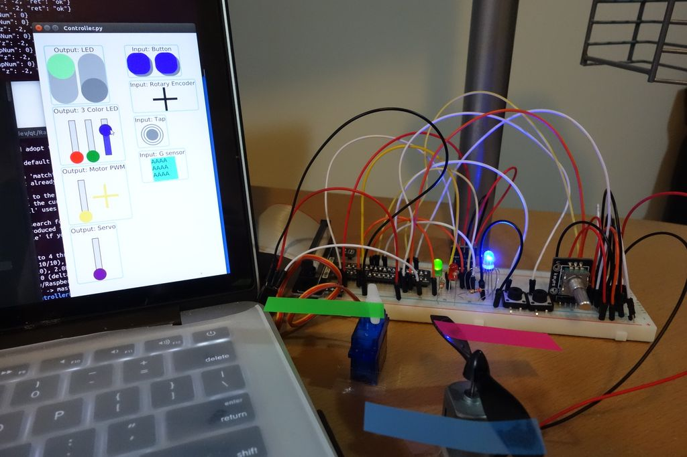
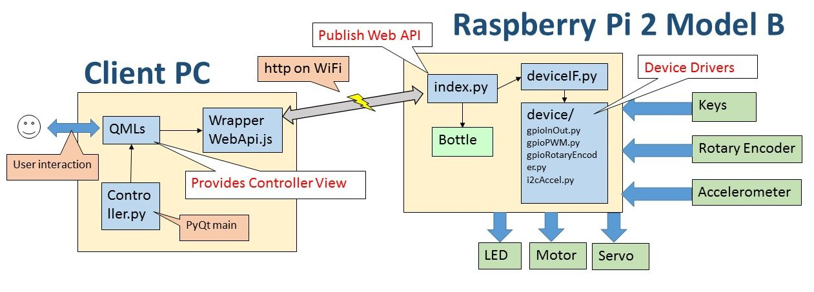

# Raspberry Pi Device Controller
* This is a project to control devices attached to Raspberry Pi. The entire project consists of Web server running on Python and Controller View created by Qt Quick (QML)
*  Python script on Raspberry Pi drives the following devices and provides Web API.
	* Output: LED
	* Output: 3 Color RGB LED
	* Output: Motor with PWM
	* Output: Servo motor
	* Input: Button
	* Input: Rotary Encoder
	* Input: Tap
	* Input: Accelerometer (ADXL345)
* Client controller, which accepts user input and shows device status, created by Qt accesses to the server using Web API with JSON. It can be executed as a PyQt or a normal Qt Application

* Link to Youtube
[](https://www.youtube.com/watch?v=BdQB3FADOIc)


## Whole picture



## Server Side (Raspberry Pi)
### Environment
* Python 2.7

### Libraries required
* Bottle (source included)
* RPi.GPIO
* i2c-tools
* python-smbus

### How to start server
```
cd Server
python index.py
```

## Controller Side (PC or Raspberry Pi)
### Environment
* Qt Quick 2.0 (QML)
* PyQt (if you want)

### How to start controller (as PyQt)
```
python Controller.py &
```

### How to start controller (as QtQuick)
start ControllerComponent qml project from Qt Creator

### How to install PyQt
```
sudo apt-get install qt5-default
sudo apt-get install python-pyqt5
sudo apt-get install python-pyqt5.qtquick
```
